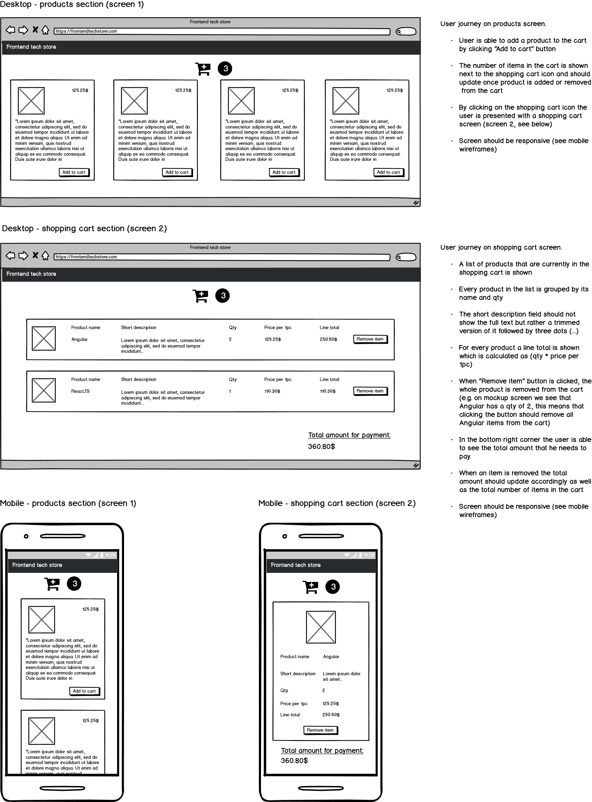

# Zuhlke frontend coding assignment

Welcome to the Frontend tech store development team!

Frontend tech store allows developers to buy best libraries and frameworks from web ecosystem and we need your support in making our online store even better. We've already gathered all requirements but some parts of our online store are still under construction and this is where you come in!

Read through the requirements and check out the wireframes. The submitted solution should cover all requirements from the below document.

The solution should be implemented with existing tools and libraries that are part of this repo and additional libraries like Redux etc. should **NOT** be installed!

For setting up your development environment, see [Getting started](#getting-started---step-by-step) section.

## Getting started - step by step

This project was generated with [Angular CLI](https://github.com/angular/angular-cli) version 8.3.20.

- Install [NodeJS](https://nodejs.org/en/)
- `cd` into this folder
- Run `npm install`

## Development

Run `npm start` for a dev server. Navigate to `http://localhost:4200/`. The app will automatically reload if you change any of the source files.

Run `npm test` to execute the unit tests via [Karma](https://karma-runner.github.io).

Run `ng generate component component-name` to generate a new component. You can also use `ng generate directive|pipe|service|class|guard|interface|enum|module`.
